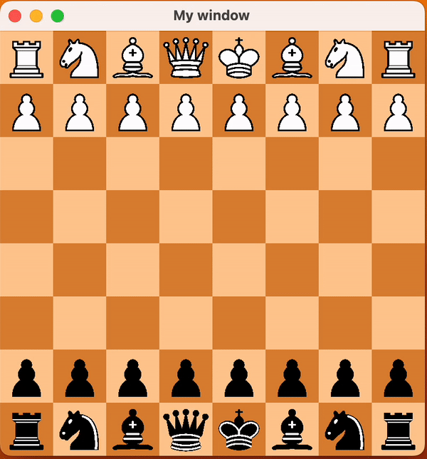

# chess
A simple chess game written in C++. It uses the SFML library for graphics. It is a work in progress.
It is currently playable, but there are still some bugs and missing features.
It eventually will be able to play against a computer opponent. And it will be able to tell
you how good your moves are. Going to use different algorithms to build the AI.

## Tested on Mac OS X Ventura Version 13.2.1
### cmake
use cmake to build the project
```
mkdir build
cd build
cmake ..
make
```
### SFML
install SFML
```
brew install sfml
```
### Run
```
cd build
./chess
```

## Demo


## TODO
- [x] Add a chess board
- [x] Add pieces
- [x] Add movement
- [x] Add capturing
- [] Add check
- [] Add checkmate
- [] Add stalemate
- [x] Add castling
- [x] Add en passant
- [] Add pawn promotion
- [] Add AI
- [] Add AI difficulty levels
- [] Add AI move evaluation
- [] Add AI move suggestions
- [] Add AI move hints
- [] Add AI move history
- [] Add AI move undo
- [] Add different AI algorithms

## Author
## Sourena Khanzadeh
